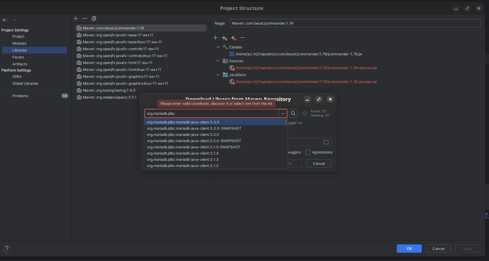
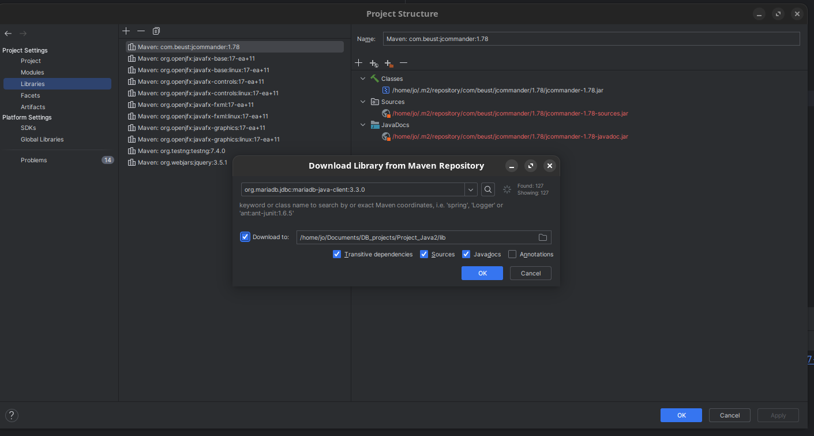

# Admin fuer DVD Verleih 

## Funktionen
* kunden verwalten (add, update und delete)
* Film verwalten (add, update und delete)
* verleih verwalten (add, update und delete)

## Such Funktionen
* customer 
  - Last name 
  - Membershipstatus
* Film
  - Last name (cast)
  - Release Date mit sql like z.B 20 fuer alle Filme ab 2000
* Rental Info - customer Id

# Einrichtung Jetbrains IntelliJ
  
  